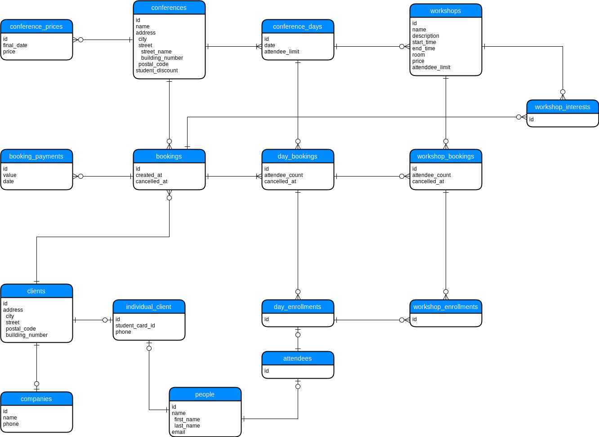

## Projekt

### Diagram ER



## Tabele

### `conferences`
Tabela zawierająca organizowane konferencje.

| Kolumna | Opis |
| --- | --- |
| `id` | identyfikator konferencji |
| `name` | nazwa konferencji |
| `city`, `street`, `postal_code`, `building_number` | dane adresowe |
| `student_discount` | zniżka studencka z przedziału [0.0000, 1.0000] |

```sql
CREATE TABLE conferences (
  id INT NOT NULL IDENTITY PRIMARY KEY,
  name VARCHAR(50) NOT NULL,
  city VARCHAR(50) NOT NULL,
  street VARCHAR(50) NOT NULL,
  postal_code VARCHAR(10) NOT NULL,
  building_number VARCHAR(10) NOT NULL,
  student_discount DECIMAL(5, 4) NOT NULL DEFAULT 0
);
```

### `conference_days`

Tabela zawierająca informacje o poszczególnych dniach konferencji.

| Kolumna | Opis |
| --- | --- |
| `id` | |
| `conference_id` | identyfikator konferencji |
| `date` | data której dotyczy dzień konferencji |
| `attendee_limit` | maksymalna liczba uczestników tego dnia |

```sql
CREATE TABLE conference_days (
  id INT NOT NULL IDENTITY PRIMARY KEY,
  conference_id INT NOT NULL FOREIGN KEY REFERENCES conferences(id),
  date DATE NOT NULL,
  attendee_limit INT NOT NULL
);
```

### `workshops`

Tabela zawierająca informacje o warsztatach odbywajacych się w ramach konferencji w konkretnym dniu.

| Kolumna | Opis |
| --- | --- |
| `id` | |
| `conference_day_id` | |
| `name`, `description` | informacje o warsztacie |
| `start`, `end` | przedział czasowy, w którym odbywa się warsztat |
| `room` | informacja o dokładnym miejscu obywania się warsztatu w budynku konferencji |
| `price` | stała cena za warsztat |
| `attendee_limit` | maksymalna liczba uczestników tego warsztatu |

```sql
CREATE TABLE workshops (
  id INT NOT NULL IDENTITY PRIMARY KEY,
  conference_day_id INT NOT NULL FOREIGN KEY REFERENCES conference_days(id),
  name VARCHAR(50) NOT NULL,
  description VARCHAR(1000) NOT NULL,
  start_time TIME NOT NULL,
  end_time TIME NOT NULL,
  room VARCHAR(30) NOT NULL,
  price MONEY NOT NULL,
  attendee_limit INT NOT NULL
);
```

### `conference_prices`

Tabela zawierająca progi cenowe za jeden dzień konferencji w zależności od czasu.

| Kolumna | Opis |
| --- | --- |
| `id` | |
| `conference_id` | |
| `final_date` | data do której obowiązuje dana cena |
| `price` | cena w danym czasie |

```sql
CREATE TABLE conference_prices (
  id INT NOT NULL IDENTITY PRIMARY KEY,
  conference_id INT NOT NULL FOREIGN KEY REFERENCES conferences(id),
  final_date DATE NOT NULL,
  price MONEY NOT NULL
);
```

### `clients`

Tabela zawierająca podstawowe dane o klientach dokonujących rezerwacji.

| Kolumna | Opis |
| --- | --- |
| `id` | |
| `city`, `street`, `postal_code`, `building_number` | dane adresowe klienta |

```sql
CREATE TABLE clients (
  id INT NOT NULL IDENTITY PRIMARY KEY,
  city VARCHAR(50) NOT NULL,
  street VARCHAR(50) NOT NULL,
  postal_code VARCHAR(10) NOT NULL,
  building_number VARCHAR(10) NOT NULL
);
```

### `companies`

Tabela zawierająca dodatkowe dane firm będących klientami.

| Kolumna | Opis |
| --- | --- |
| `id` | |
| `client_id` | |
| `name` | nazwa firmy |
| `phone` | numer telefonu firmy |

```sql
CREATE TABLE companies (
  id INT NOT NULL IDENTITY PRIMARY KEY,
  client_id INT NOT NULL FOREIGN KEY REFERENCES clients(id),
  name VARCHAR(50) NOT NULL,
  phone VARCHAR(15) NOT NULL
);
```

### `people`

Tabela zawierająca podstawowe dane osobowe.

| Kolumna | Opis |
| --- | --- |
| `id` | |
| `first_name`, `last_name` | nazwa osoby |
| `email` | adres email osoby |

```sql
CREATE TABLE people (
  id INT NOT NULL IDENTITY PRIMARY KEY,
  first_name VARCHAR(50) NOT NULL,
  last_name VARCHAR(50) NOT NULL,
  email VARCHAR(50) NOT NULL
);
```

### `individual_clients`

Tabela zwiera dodatkowe dane osób będących klientami indywidualnymi.

| Kolumna | Opis |
| --- | --- |
| `id` | |
| `client_id` | |
| `person_id` | |
| `phone` | numer telefonu klienta indywidualnego |
| `student_card_id` | numer karty studenckiej lub NULL jeżeli klient nie jest studentem |

```sql
CREATE TABLE individual_clients (
  id INT NOT NULL IDENTITY PRIMARY KEY,
  client_id INT NOT NULL FOREIGN KEY REFERENCES clients(id),
  person_id INT NOT NULL FOREIGN KEY REFERENCES people(id),
  phone VARCHAR(15) NOT NULL,
  student_card_id VARCHAR(20)
);
```

### `bookings`

Tabela zawierająca informacje o rezerwacjach dokonywanych przez klientów.

| Kolumna | Opis |
| --- | --- |
| `id` | |
| `client_id` | |
| `created_at` | czas dokonania rezerwacji |
| `cancelled_at` | czas anulowania rezerwacji lub NULL jeżeli rezerwacja nie została anulowana |

```sql
CREATE TABLE bookings (
  id INT NOT NULL IDENTITY PRIMARY KEY,
  client_id INT NOT NULL FOREIGN KEY REFERENCES clients(id),
  created_at DATETIME NOT NULL,
  cancelled_at DATETIME DEFAULT NULL
);
```

### `day_bookings`

Tabela zawierająca informacje o rezerwacjach na wybrane dni dokonywanych przez klientów.

| Kolumna | Opis |
| --- | --- |
| `id` | |
| `booking_id` | |
| `conference_day_id` | |
| `attendee_count` | zarezerwowana liczba miejsc na dany dzień konferencji |
| `cancelled_at` | czas anulowania rezerwacji na dany dzień lub NULL jeżeli rezerwacja nie została anulowana |

```sql
CREATE TABLE day_bookings (
  id INT NOT NULL IDENTITY PRIMARY KEY,
  booking_id INT NOT NULL FOREIGN KEY REFERENCES bookings(id),
  conference_day_id INT NOT NULL FOREIGN KEY REFERENCES conference_days(id),
  attendee_count INT NOT NULL,
  cancelled_at DATETIME DEFAULT NULL
);
```

### `workshop_bookings`

Tabela zawierająca informacje o rezerwacjach na wybrane warsztaty dokonywanych przez klientów.

| Kolumna | Opis |
| --- | --- |
| `id` | |
| `day_booking_id` | |
| `workshop_id` | |
| `attendee_count` | zarezerwowana liczba miejsc na dany warsztat |
| `cancelled_at` | czas anulowania rezerwacji na dany warsztat lub NULL jeżeli rezerwacja nie została anulowana |

```sql
CREATE TABLE workshop_bookings (
  id INT NOT NULL IDENTITY PRIMARY KEY,
  day_booking_id INT NOT NULL FOREIGN KEY REFERENCES day_bookings(id),
  workshop_id INT NOT NULL FOREIGN KEY REFERENCES workshops(id),
  attendee_count INT NOT NULL,
  cancelled_at DATETIME DEFAULT NULL
);
```

### `day_enrollments`

Tabela wiążąca rezerwacje na dany dzień konferencji z odpowiadającymi im uczestnikami.

| Kolumna | Opis |
| --- | --- |
| `id` | |
| `day_booking_id` | |
| `attendee_id` | |

```sql
CREATE TABLE day_enrollments (
  id INT NOT NULL IDENTITY PRIMARY KEY,
  day_booking_id INT NOT NULL FOREIGN KEY REFERENCES day_bookings(id),
  attendee_id INT NOT NULL FOREIGN KEY REFERENCES people(id)
);
```

### `workshop_enrollments`

Tabela wiążąca rezerwacje na dany warsztat z zapisami na dany dzień, czyli pośrednio z odpowiadającymi im uczestnikami.

| Kolumna | Opis |
| --- | --- |
| `id` | |
| `day_enrollment_id` | |
| `workshop_booking_id` | |

```sql
CREATE TABLE workshop_enrollments (
  id INT NOT NULL IDENTITY PRIMARY KEY,
  day_enrollment_id INT NOT NULL FOREIGN KEY REFERENCES day_enrollments(id),
  workshop_booking_id INT NOT NULL FOREIGN KEY REFERENCES workshop_bookings(id)
);
```

### `booking_payments`

Tabela zawierająca informacje o płatnościach za rezerwacje.

| Kolumna | Opis |
| --- | --- |
| `id` | |
| `booking_id` | |
| `value` | wpłacona kwota |
| `date` | czas dokonania płatności |

```sql
CREATE TABLE booking_payments (
  id INT NOT NULL IDENTITY PRIMARY KEY,
  booking_id INT NOT NULL FOREIGN KEY REFERENCES bookings(id),
  value MONEY NOT NULL,
  date DATETIME NOT NULL
);
```

### `workshop_interests`

Tabela zawierająca informacje o warsztatach, którymi są zainteresowani klienci w ramach zamówienia.

| Kolumna | Opis |
| --- | --- |
| `id` | |
| `workshop_id` | |
| `booking_id` | |

```sql
CREATE TABLE workshop_interests (
  id INT NOT NULL IDENTITY PRIMARY KEY,
  workshop_id INT NOT NULL FOREIGN KEY REFERENCES workshops(id),
  booking_id INT NOT NULL FOREIGN KEY REFERENCES bookings(id)
);
```
