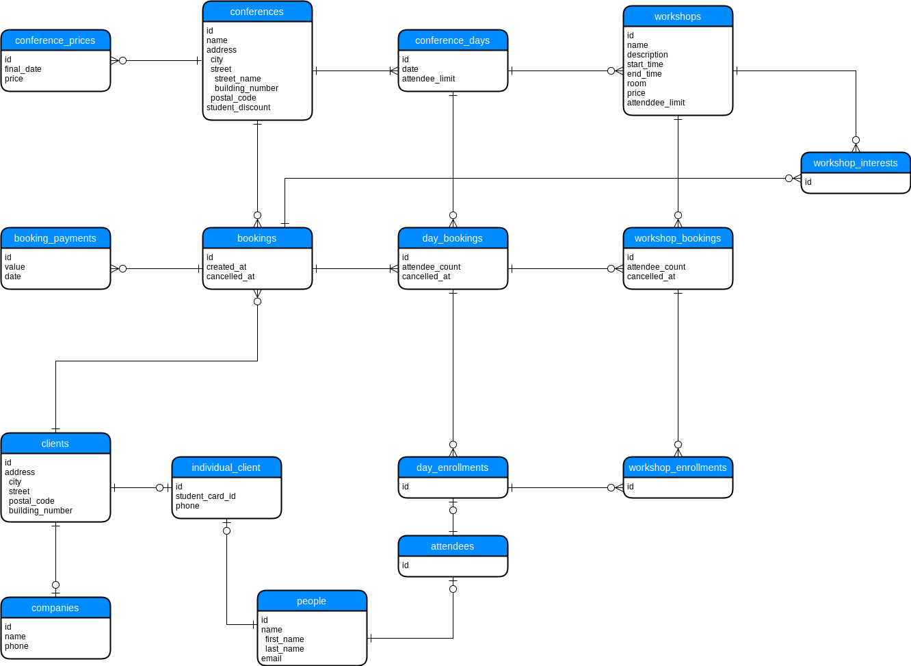
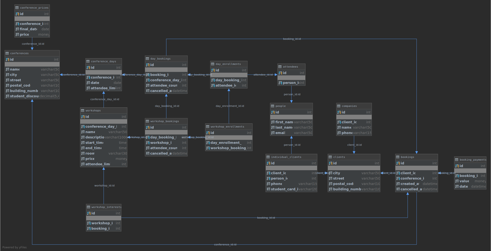

## Projekt

### Diagram ER



### Schemat



## Tabele

### `conferences`
Tabela zawierająca organizowane konferencje.

| Kolumna | Opis |
| --- | --- |
| `id` | unikalny identyfikator |
| `name` | nazwa konferencji |
| `city`, `street`, `postal_code`, `building_number` | dane adresowe |
| `student_discount` | zniżka studencka z przedziału [0.0000, 1.0000] |

Dodatkowe warunki integralności:
- `conferences__student_discount_in_range` - zapewnia, że zniżka studencka należy do właściwego przedziału

```sql
CREATE TABLE conferences (
  id INT NOT NULL IDENTITY PRIMARY KEY,
  name VARCHAR(50) NOT NULL,
  city VARCHAR(50) NOT NULL,
  street VARCHAR(50) NOT NULL,
  postal_code VARCHAR(10) NOT NULL,
  building_number VARCHAR(10) NOT NULL,
  student_discount DECIMAL(5, 4) NOT NULL DEFAULT 0

  CONSTRAINT conferences__student_discount_in_range CHECK (student_discount BETWEEN 0 AND 1)
);
```

### `conference_days`

Tabela zawierająca informacje o poszczególnych dniach konferencji.

| Kolumna | Opis |
| --- | --- |
| `id` | unikalny identyfikator |
| `conference_id` | identyfikator konferencji |
| `date` | data której dotyczy dzień konferencji |
| `attendee_limit` | maksymalna liczba uczestników tego dnia |

Dodatkowe warunki integralności:
- `conference_days__unique_date_within_conference` - zapewnia, że dana konferencja nie ma wielu dni o tej samej dacie
- `conference_days__positive_attendee_limit` - zapewnia, że limit uczestników jest liczbą dodatnią

```sql
CREATE TABLE conference_days (
  id INT NOT NULL IDENTITY PRIMARY KEY,
  conference_id INT NOT NULL FOREIGN KEY REFERENCES conferences(id),
  date DATE NOT NULL,
  attendee_limit INT NOT NULL,

  CONSTRAINT conference_days__unique_date_within_conference UNIQUE (conference_id, date),
  CONSTRAINT conference_days__positive_attendee_limit CHECK (attendee_limit > 0)
);
```

### `workshops`

Tabela zawierająca informacje o warsztatach odbywajacych się w ramach konferencji w konkretnym dniu.

| Kolumna | Opis |
| --- | --- |
| `id` | unikalny identyfikator |
| `conference_day_id` | identyfikator dnia konferencji |
| `name`, `description` | informacje o warsztacie |
| `start`, `end` | przedział czasowy, w którym odbywa się warsztat |
| `room` | informacja o dokładnym miejscu obywania się warsztatu w budynku konferencji |
| `price` | stała cena za warsztat |
| `attendee_limit` | maksymalna liczba uczestników tego warsztatu |

Dodatkowe warunki integralności:
- `workshops__positive_attendee_limit` - zapewnia, że limit uczestników jest liczbą dodatnią
- `workshops__positive_price` - zapewnia, że cena warsztatu jest liczbą dodatnią

```sql
CREATE TABLE workshops (
  id INT NOT NULL IDENTITY PRIMARY KEY,
  conference_day_id INT NOT NULL FOREIGN KEY REFERENCES conference_days(id),
  name VARCHAR(50) NOT NULL,
  description VARCHAR(1000) NOT NULL,
  start_time TIME NOT NULL,
  end_time TIME NOT NULL,
  room VARCHAR(30) NOT NULL,
  price MONEY NOT NULL,
  attendee_limit INT NOT NULL,

  CONSTRAINT workshops__positive_attendee_limit CHECK (attendee_limit > 0),
  CONSTRAINT workshops__positive_price CHECK (price > 0)
);
```

### `conference_prices`

Tabela zawierająca progi cenowe za jeden dzień konferencji w zależności od czasu.

| Kolumna | Opis |
| --- | --- |
| `id` | unikalny identyfikator |
| `conference_id` | identyfikator konferencji |
| `final_date` | data do której obowiązuje dana cena |
| `price` | cena w danym czasie |

Dodatkowe warunki integralności:
- `conference_prices__positive_price` - zapewnia, że cena jest liczbą dodatnią
- `conference_prices__unique_final_date_within_conference` - zapewnia, że dana konferencja nie ma wielu progów cenowych obowiazujących do tej samej daty

```sql
CREATE TABLE conference_prices (
  id INT NOT NULL IDENTITY PRIMARY KEY,
  conference_id INT NOT NULL FOREIGN KEY REFERENCES conferences(id),
  final_date DATE NOT NULL,
  price MONEY NOT NULL,

  CONSTRAINT conference_prices__positive_price CHECK (price > 0),
  CONSTRAINT conference_prices__unique_final_date_within_conference UNIQUE (conference_id, final_date)
);
```

### `clients`

Tabela zawierająca podstawowe dane o klientach dokonujących rezerwacji.

| Kolumna | Opis |
| --- | --- |
| `id` | unikalny identyfikator |
| `city`, `street`, `postal_code`, `building_number` | dane adresowe klienta |

```sql
CREATE TABLE clients (
  id INT NOT NULL IDENTITY PRIMARY KEY,
  city VARCHAR(50) NOT NULL,
  street VARCHAR(50) NOT NULL,
  postal_code VARCHAR(10) NOT NULL,
  building_number VARCHAR(10) NOT NULL
);
```

### `companies`

Tabela zawierająca dodatkowe dane firm będących klientami.

| Kolumna | Opis |
| --- | --- |
| `id` | unikalny identyfikator |
| `client_id` | identyfikator klienta |
| `name` | nazwa firmy |
| `phone` | numer telefonu firmy |

Dodatkowe warunki integralności:
- `companies__unique_phone` - zapewnia, że numer telefonu firmy jest unikalny

```sql
CREATE TABLE companies (
  id INT NOT NULL IDENTITY PRIMARY KEY,
  client_id INT NOT NULL FOREIGN KEY REFERENCES clients(id),
  name VARCHAR(50) NOT NULL,
  phone VARCHAR(15) NOT NULL,

  CONSTRAINT companies__unique_phone UNIQUE (phone)
);
```

### `people`

Tabela zawierająca podstawowe dane osobowe.

| Kolumna | Opis |
| --- | --- |
| `id` | unikalny identyfikator |
| `first_name`, `last_name` | imię i nazwisko osoby |
| `email` | adres email osoby |

Dodatkowe warunki integralności:
- `people__unique_email` - zapewnia, że adres email osoby jest unikalny

```sql
CREATE TABLE people (
  id INT NOT NULL IDENTITY PRIMARY KEY,
  first_name VARCHAR(50) NOT NULL,
  last_name VARCHAR(50) NOT NULL,
  email VARCHAR(50) NOT NULL,

  CONSTRAINT people__unique_email UNIQUE (email)
);
```

### `individual_clients`

Tabela zwiera dodatkowe dane osób będących klientami indywidualnymi.

| Kolumna | Opis |
| --- | --- |
| `id` | unikalny identyfikator |
| `client_id` | identyfikator klienta |
| `person_id` | identyfikator osoby |
| `phone` | numer telefonu klienta indywidualnego |
| `student_card_id` | numer karty studenckiej lub NULL jeżeli klient nie jest studentem |

Dodatkowe warunki integralności:
- `individual_clients__unique_phone` - zapewnia, że numer telefonu klienta indywidualnego jest unikalny

```sql
CREATE TABLE individual_clients (
  id INT NOT NULL IDENTITY PRIMARY KEY,
  client_id INT NOT NULL FOREIGN KEY REFERENCES clients(id),
  person_id INT NOT NULL FOREIGN KEY REFERENCES people(id),
  phone VARCHAR(15) NOT NULL,
  student_card_id VARCHAR(20),

  CONSTRAINT individual_clients__unique_phone UNIQUE (phone)
);
```

### `bookings`

Tabela zawierająca informacje o rezerwacjach dokonywanych przez klientów.

| Kolumna | Opis |
| --- | --- |
| `id` | unikalny identyfikator |
| `client_id` | identyfikator klienta |
| `created_at` | czas dokonania rezerwacji |
| `cancelled_at` | czas anulowania rezerwacji lub NULL jeżeli rezerwacja nie została anulowana |

Dodatkowe warunki integralności:
- `bookings__unique_client_within_conference` - zapewnia, że dana konferencja nie ma wielu rezerwacji tego samego klienta

```sql
CREATE TABLE bookings (
  id INT NOT NULL IDENTITY PRIMARY KEY,
  client_id INT NOT NULL FOREIGN KEY REFERENCES clients(id),
  conference_id INT NOT NULL FOREIGN KEY REFERENCES conferences(id),
  created_at DATETIME NOT NULL,
  cancelled_at DATETIME DEFAULT NULL,

  CONSTRAINT bookings__unique_client_within_conference UNIQUE (client_id, conference_id)
);
```

### `day_bookings`

Tabela zawierająca informacje o rezerwacjach na wybrane dni dokonywanych przez klientów.

| Kolumna | Opis |
| --- | --- |
| `id` | unikalny identyfikator |
| `booking_id` | identyfikator rezerwacji |
| `conference_day_id` | identyfikator dnia konferencji |
| `attendee_count` | zarezerwowana liczba miejsc na dany dzień konferencji |
| `cancelled_at` | czas anulowania rezerwacji na dany dzień lub NULL jeżeli rezerwacja nie została anulowana |

Dodatkowe warunki integralności:
- `day_bookings__positive_attendee_count` - zapewnia, że zarezerwowana liczba miejsc na dzień konferencji jest dodatnia
- `day_bookings__unique_conference_day_within_booking` - zapewnia, że dane zamówienie nie ma wielu rezerwacji na ten same dzień

```sql
CREATE TABLE day_bookings (
  id INT NOT NULL IDENTITY PRIMARY KEY,
  booking_id INT NOT NULL FOREIGN KEY REFERENCES bookings(id),
  conference_day_id INT NOT NULL FOREIGN KEY REFERENCES conference_days(id),
  attendee_count INT NOT NULL,
  cancelled_at DATETIME DEFAULT NULL,

  CONSTRAINT day_bookings__positive_attendee_count CHECK (attendee_count > 0),
  CONSTRAINT day_bookings__unique_conference_day_within_booking UNIQUE (conference_day_id, booking_id)
);
```

### `workshop_bookings`

Tabela zawierająca informacje o rezerwacjach na wybrane warsztaty dokonywanych przez klientów.

| Kolumna | Opis |
| --- | --- |
| `id` | unikalny identyfikator |
| `day_booking_id` | identyfikator rezerwacji na dzień konferencji |
| `workshop_id` | identyfikator warsztatu |
| `attendee_count` | zarezerwowana liczba miejsc na dany warsztat |
| `cancelled_at` | czas anulowania rezerwacji na dany warsztat lub NULL jeżeli rezerwacja nie została anulowana |

Dodatkowe warunki integralności:
- `workshop_bookings__positive_attendee_count` - zapewnia, że zarezerwowana liczba miejsc na warsztat jest dodatnia
- `workshop_bookings__unique_workshop_within_day_booking` - zapewnia, że dana rezerwacja na dzień konferencji nie ma wielu rezerwacji na ten sam warsztat

```sql
CREATE TABLE workshop_bookings (
  id INT NOT NULL IDENTITY PRIMARY KEY,
  day_booking_id INT NOT NULL FOREIGN KEY REFERENCES day_bookings(id),
  workshop_id INT NOT NULL FOREIGN KEY REFERENCES workshops(id),
  attendee_count INT NOT NULL,
  cancelled_at DATETIME DEFAULT NULL,

  CONSTRAINT workshop_bookings__positive_attendee_count CHECK (attendee_count > 0),
  CONSTRAINT workshop_bookings__unique_workshop_within_day_booking UNIQUE (workshop_id, day_booking_id)
);
```

### `attendees`

Tabela zawierająca informacje o uczestnikach konferencji.

| Kolumna | Opis |
| --- | --- |
| `id` | unikalny identyfikator |
| `person_id` | identyfikator osoby (dane osobowe) |

```sql
CREATE TABLE attendees (
  id INT NOT NULL IDENTITY PRIMARY KEY,
  person_id INT NOT NULL FOREIGN KEY REFERENCES people(id)
);
```

### `day_enrollments`

Tabela wiążąca rezerwacje na dany dzień konferencji z odpowiadającymi im uczestnikami.

| Kolumna | Opis |
| --- | --- |
| `id` | unikalny identyfikator |
| `day_booking_id` | identyfikator rezerwacji na dzień konferencji |
| `attendee_id` | identyfikator uczestnika |

Dodatkowe warunki integralności:
- `day_enrollments__unique_attendee_within_day_booking` - zapewnia, że dana rezerwacja na dzień nie ma powielonych uczestników

```sql
CREATE TABLE day_enrollments (
  id INT NOT NULL IDENTITY PRIMARY KEY,
  day_booking_id INT NOT NULL FOREIGN KEY REFERENCES day_bookings(id),
  attendee_id INT NOT NULL FOREIGN KEY REFERENCES attendees(id),

  CONSTRAINT day_enrollments__unique_attendee_within_day_booking UNIQUE (attendee_id, day_booking_id)
);
```

### `workshop_enrollments`

Tabela wiążąca rezerwacje na dany warsztat z zapisami na dany dzień, czyli pośrednio z odpowiadającymi im uczestnikami.

| Kolumna | Opis |
| --- | --- |
| `id` | unikalny identyfikator |
| `day_enrollment_id` | identyfikator zapisu na dany dzień |
| `workshop_booking_id` | identyfikator rezerwacji na warsztat |

Dodatkowe warunki integralności:
- `workshop_enrollments__unique_workshop_within_day_enrollment` - zapewnia, że dana rezerwacja na dzień nie ma wielu tych samych warsztatów

```sql
CREATE TABLE workshop_enrollments (
  id INT NOT NULL IDENTITY PRIMARY KEY,
  day_enrollment_id INT NOT NULL FOREIGN KEY REFERENCES day_enrollments(id),
  workshop_booking_id INT NOT NULL FOREIGN KEY REFERENCES workshop_bookings(id),

  CONSTRAINT workshop_enrollments__unique_workshop_within_day_enrollment UNIQUE (workshop_booking_id, day_enrollment_id)
);
```

### `booking_payments`

Tabela zawierająca informacje o płatnościach za rezerwacje.

| Kolumna | Opis |
| --- | --- |
| `id` | unikalny identyfikator |
| `booking_id` | identyfikator rezerwacji |
| `value` | wpłacona kwota |
| `date` | czas dokonania płatności |

Dodatkowe warunki integralności:
- `booking_payments__positive_value` - zapewnia, że zapłacona kwota jest dodatnia

```sql
CREATE TABLE booking_payments (
  id INT NOT NULL IDENTITY PRIMARY KEY,
  booking_id INT NOT NULL FOREIGN KEY REFERENCES bookings(id),
  value MONEY NOT NULL,
  date DATETIME NOT NULL,

  CONSTRAINT booking_payments__positive_value CHECK (value > 0)
);
```

### `workshop_interests`

Tabela zawierająca informacje o warsztatach, którymi są zainteresowani klienci w ramach rezerwacji.

| Kolumna | Opis |
| --- | --- |
| `id` | unikalny identyfikator |
| `workshop_id` | identyfikator warsztatu |
| `booking_id` | identyfikator rezerwacji |

Dodatkowe warunki integralności:
- `workshop_interests__unique_workshop_within_booking` - zapewnia, że dana rezerwacja nie ma wielu zainteresowań tym samym warsztatem

```sql
CREATE TABLE workshop_interests (
  id INT NOT NULL IDENTITY PRIMARY KEY,
  workshop_id INT NOT NULL FOREIGN KEY REFERENCES workshops(id),
  booking_id INT NOT NULL FOREIGN KEY REFERENCES bookings(id),

  CONSTRAINT workshop_interests__unique_workshop_within_booking UNIQUE (workshop_id, booking_id)
);
```

## Widoki

### `badges_view`

Widok zawierający informacje potrzebne do stworzenia identyfikatorów dla uczestników konferencji.

```sql
CREATE VIEW badges_view
AS
SELECT DISTINCT
  bookings.conference_id,
  people.first_name,
  people.last_name,
  people.email,
  companies.name company_name
FROM attendees
JOIN people ON people.id = attendees.person_id
JOIN day_enrollments ON attendees.id = day_enrollments.attendee_id
JOIN day_bookings ON day_bookings.id = day_enrollments.day_booking_id
JOIN bookings ON bookings.id = day_bookings.booking_id
JOIN clients ON clients.id = bookings.client_id
LEFT JOIN companies ON companies.client_id = clients.id;
```

### `client_statistics_view`

Widok zawierający statystyki dotyczące aktywności klientów.
Pozwala na łatwe wyszukanie najczęstszych oraz najbardziej zyskownych klientów.

```sql
CREATE VIEW client_statistics_view
AS
SELECT
  clients.id client_id,
  COUNT(DISTINCT bookings.id) number_of_bookings,
  SUM(booking_payments.value) total_payments
FROM clients
JOIN bookings ON bookings.client_id = clients.id
LEFT JOIN booking_payments ON booking_payments.booking_id = bookings.id
GROUP BY clients.id;
```

### `upcoming_conferences_summary_view`

Widok zawierający dodatkowe dane na temat nadchodzących konferencji,
w tym obecnie obowiązującą cene za jeden dzień oraz liczbe wolnych miejsc na wszystkie dni konferencji.

```sql
CREATE VIEW upcoming_conferences_summary_view
AS
SELECT
  conferences.id conference_id,
  conferences.name conference_name,
  MIN(conference_days.date) start_date,
  MAX(conference_days.date) end_date,
  dbo.day_price_on(conferences.id, GETDATE()) price_per_day,
  MIN(dbo.available_conference_day_spots(conference_days.id)) available_all_day_spots
FROM conferences
JOIN conference_days ON conference_days.conference_id = conferences.id
WHERE conference_days.date >= GETDATE()
GROUP BY conferences.id, conferences.name;
```

### `monthly_incomes_view`

Widok zawiera sumaryczną wartość przychodów dla każdego z miesięcy.

```sql
CREATE VIEW monthly_incomes_view
AS
SELECT
  YEAR(date) year,
  MONTH(date) month,
  SUM(value) income
FROM booking_payments
GROUP BY YEAR(date), MONTH(date);
```

### `booking_costs_view`

Widok zawiera podsumowanie kosztów każdego z zamówień, w szczególności kwotę pozostałą do opłacenia.

```sql
CREATE VIEW booking_costs_view
AS
WITH booking_costs AS (
  SELECT
    id,
    dbo.booking_full_days_cost(id) full_days_cost,
    dbo.booking_full_workshops_cost(id) full_workshops_cost,
    dbo.booking_discount(id) discount,
    dbo.booking_paid_amount(id) paid_amount
  FROM bookings
)
SELECT
  id,
  full_days_cost,
  full_workshops_cost,
  discount,
  (full_days_cost + full_workshops_cost) * (1 - discount) AS total_cost,
  paid_amount,
  (full_days_cost + full_workshops_cost) * (1 - discount) - paid_amount AS to_pay
FROM booking_costs;
```

### `missing_attendees_view`

Widok zawiera dane firm, które nie wyspecyfikowaly wszystkich uczestników
na poszczególne dni oraz warsztaty w stosownym czasie (do 14 dni przed konferencją).

```sql
CREATE VIEW missing_attendees_view
AS
SELECT
  bookings.conference_id conference_id,
  companies.name company_name,
  companies.phone company_phone
FROM bookings
JOIN companies ON companies.client_id = bookings.client_id
WHERE cancelled_at IS NULL
  AND DATEDIFF(DAY, GETDATE(), dbo.conference_start_date(bookings.conference_id)) < 14
  AND bookings.id IN (
    -- Missing attendees for a booked conference day
    SELECT DISTINCT booking_id
    FROM day_bookings
    LEFT JOIN day_enrollments ON day_bookings.id = day_enrollments.day_booking_id
    GROUP BY day_bookings.id, day_bookings.booking_id, day_bookings.attendee_count
    HAVING day_bookings.attendee_count > COUNT(day_enrollments.id)
    UNION
    -- Missing attendees for a booked workshop
    SELECT DISTINCT booking_id
    FROM workshop_bookings
    JOIN day_bookings ON workshop_bookings.day_booking_id = day_bookings.id
    LEFT JOIN workshop_enrollments ON workshop_bookings.id = workshop_enrollments.workshop_booking_id
    GROUP BY workshop_bookings.id, day_bookings.booking_id, workshop_bookings.attendee_count
    HAVING workshop_bookings.attendee_count > COUNT(workshop_enrollments.id)
  );
```

## Funkcje

### `day_price_on`

Funkcja wyznaczająca cenę za jeden dzień danej konferencji we wskazanym dniu.

```sql
CREATE FUNCTION day_price_on(
  @conference_id INT,
  @date DATE
)
RETURNS MONEY
AS
BEGIN
  RETURN (
    SELECT TOP 1 price
    FROM conference_prices
    WHERE conference_id = @conference_id AND final_date >= @date
    ORDER BY final_date
  )
END
```

### `available_conference_day_spots`

Funkcja wyznaczająca liczbę wolnych miejsc wskazany dzień konferencji.

```sql
CREATE FUNCTION available_conference_day_spots(
  @conference_day_id INT
)
RETURNS INT
AS
BEGIN
  RETURN (
    SELECT
      attendee_limit - ISNULL(SUM(day_bookings.attendee_count), 0)
    FROM conference_days
    LEFT JOIN day_bookings ON day_bookings.conference_day_id = conference_days.id
    WHERE conference_days.id = @conference_day_id
      AND day_bookings.cancelled_at IS NULL
    GROUP BY conference_days.id, conference_days.attendee_limit
  )
END
```

### `available_workshop_spots`

Funkcja wyznaczająca liczbę wolnych miejsc wskazany warsztat.

```sql
CREATE FUNCTION available_workshop_spots(
  @workshop_id INT
)
RETURNS INT
AS
BEGIN
  RETURN (
    SELECT
      attendee_limit - ISNULL(SUM(workshop_bookings.attendee_count), 0)
    FROM workshops
    LEFT JOIN workshop_bookings ON workshop_bookings.workshop_id = workshops.id
    WHERE workshops.id = @workshop_id
       AND workshop_bookings.cancelled_at IS NULL
    GROUP BY workshops.id, workshops.attendee_limit
  )
END
```

### `conference_day_attendees`

Funkcja zwracająca listę uczestników na wskazany dzień konferencji.

```sql
CREATE FUNCTION conference_day_attendees(
  @conference_day_id INT
)
RETURNS TABLE
AS
RETURN (
  SELECT
    attendees.id attendee_id,
    people.*
  FROM attendees
  JOIN people ON people.id = attendees.person_id
  JOIN day_enrollments ON day_enrollments.attendee_id = attendees.id
  JOIN day_bookings ON day_bookings.id = day_enrollments.day_booking_id
  WHERE day_bookings.conference_day_id = @conference_day_id
    AND day_bookings.cancelled_at IS NULL
);
```

### `workshop_attendees`

Funkcja zwracająca listę uczestników na wskazany warsztat.

```sql
CREATE FUNCTION workshop_attendees(
  @workshop_id INT
)
RETURNS TABLE
AS
RETURN (
  SELECT
    attendees.id attendee_id,
    people.*
  FROM attendees
  JOIN people ON people.id = attendees.person_id
  JOIN day_enrollments ON day_enrollments.attendee_id = attendees.id
  JOIN workshop_bookings ON workshop_bookings.day_booking_id = day_enrollments.day_booking_id
  WHERE workshop_bookings.workshop_id = @workshop_id
    AND workshop_bookings.cancelled_at IS NULL
);
```

### `attendee_workshops`

Funkcja zwracająca listę warsztatów dla wskazanego uczestnika na wskazanej konferncji.

```sql
CREATE FUNCTION attendee_workshops(
  @attendee_id INT,
  @conference_id INT
)
RETURNS TABLE
AS
RETURN (
  SELECT workshops.*
  FROM workshops
  JOIN conference_days ON conference_days.id = workshops.conference_day_id
  WHERE conference_days.conference_id = @conference_id
    AND @attendee_id IN (SELECT attendee_id FROM dbo.workshop_attendees(workshops.id))
);
```

### `booking_full_days_cost`

Funkcja zwracająca całkowitą kwotę za same dni konferencji dla wskazanego zamówienia.

```sql
CREATE FUNCTION booking_full_days_cost(
  @booking_id INT
)
RETURNS INT
AS
BEGIN
  RETURN (
    SELECT
      SUM(dbo.day_price_on(bookings.conference_id, bookings.created_at) * day_bookings.attendee_count)
    FROM day_bookings
    JOIN bookings ON bookings.id = day_bookings.booking_id
    WHERE booking_id = @booking_id
  )
END
```

### `booking_full_workshops_cost`

Funkcja zwracająca całkowitą kwotę za warsztaty dla wskazanego zamówienia.

```sql
CREATE FUNCTION booking_full_workshops_cost(
  @booking_id INT
)
RETURNS INT
AS
BEGIN
  RETURN (
    SELECT
      SUM(workshops.price * workshop_bookings.attendee_count)
    FROM workshop_bookings
    JOIN day_bookings ON day_bookings.id = workshop_bookings.day_booking_id
    JOIN workshops ON workshops.id = workshop_bookings.workshop_id
    WHERE day_bookings.booking_id = @booking_id
  )
END
```

### `booking_paid_amount`

Funkcja zwracająca całkowitą sumę płatności dokonanych w ramach wskazanego zamówienia.

```sql
CREATE FUNCTION booking_paid_amount(
  @booking_id INT
)
RETURNS INT
AS
BEGIN
  RETURN (
    SELECT SUM(value)
    FROM booking_payments
    WHERE booking_id = @booking_id
  )
END
```

### `booking_discount`

Funkcja zwracająca zniżkę przysługującą wskazanemu zamówieniu
(w przypadku klienta indywidualnego będącego studentem jest to zniżka studencka).

```sql
CREATE FUNCTION booking_discount(
  @booking_id INT
)
RETURNS INT
AS
BEGIN
  RETURN (
    SELECT IIF(individual_clients.student_card_id IS NOT NULL, conferences.student_discount, 0)
    FROM bookings
    JOIN conferences ON conferences.id = bookings.conference_id
    JOIN clients ON clients.id = bookings.client_id
    LEFT JOIN individual_clients ON clients.id = individual_clients.client_id
    WHERE bookings.id = @booking_id
  )
END
```

### `conference_start_date`

Funkcja zwracająca datę pierwszego dnia wskazanej konferencji.

```sql
CREATE FUNCTION conference_start_date(
  @conference_id INT
)
RETURNS DATE
AS
BEGIN
  RETURN (
    SELECT MIN(date)
    FROM conference_days
    WHERE conference_id = @conference_id
  )
END
```

### `conference_end_date`

Funkcja zwracająca datę ostatniego dnia wskazanej konferencji.

```sql
CREATE FUNCTION conference_end_date(
  @conference_id INT
)
RETURNS DATE
AS
BEGIN
  RETURN (
    SELECT MAX(date)
    FROM conference_days
    WHERE conference_id = @conference_id
  )
END
```

### `available_booked_day_spots`

Funkcja wyznaczająca liczbę wolnych zarezerwowanych miejsc dla wskazanej rezerwacji na dzień konferencji.

```sql
CREATE FUNCTION available_booked_day_spots(
  @day_booking_id INT
)
RETURNS INT
AS
BEGIN
  RETURN (
    SELECT
      attendee_count - ISNULL(COUNT(day_enrollments.id), 0)
    FROM day_bookings
    LEFT JOIN day_enrollments ON day_enrollments.day_booking_id = day_bookings.id
    WHERE day_bookings.id = @day_booking_id
    GROUP BY day_bookings.id, day_bookings.attendee_count
  )
END
```

### `available_booked_workshop_spots`

Funkcja wyznaczająca liczbę wolnych zarezerwowanych miejsc dla wskazanej rezerwacji na warsztat.

```sql
CREATE FUNCTION available_booked_workshop_spots(
  @workshop_booking_id INT
)
RETURNS INT
AS
BEGIN
  RETURN (
    SELECT
      attendee_count - ISNULL(COUNT(workshop_enrollments.id), 0)
    FROM workshop_bookings
    LEFT JOIN workshop_enrollments ON workshop_enrollments.workshop_booking_id = workshop_bookings.id
    WHERE workshop_bookings.id = @workshop_booking_id
    GROUP BY workshop_bookings.id, workshop_bookings.attendee_count
  )
END
```

### `workshop_start_date`

Funkcja zwracająca pełną datę rozpoczęcia warsztatu.

```sql
CREATE FUNCTION workshop_start_date(
  @workshop_id INT
)
RETURNS DATETIME
AS
BEGIN
  RETURN (
    SELECT CAST(conference_days.date AS DATETIME) + CAST(workshops.start_time AS DATETIME)
    FROM workshops
    JOIN conference_days ON conference_days.id = workshops.conference_day_id
    WHERE workshops.id = @workshop_id
  );
END
```

### `workshop_end_date`

Funkcja zwracająca pełną datę zakończenia warsztatu.

```sql
CREATE FUNCTION workshop_end_date(
  @workshop_id INT
)
RETURNS DATETIME
AS
BEGIN
  RETURN (
    SELECT CAST(conference_days.date AS DATETIME) + CAST(workshops.end_time AS DATETIME)
    FROM workshops
    JOIN conference_days ON conference_days.id = workshops.conference_day_id
    WHERE workshops.id = @workshop_id
  );
END
```

### `workshops_overlap`

Funkcja sprawdzająca czy wskazane dwa warsztaty odbywają się w tym samym czasie (co najmniej częściowo).

```sql
CREATE FUNCTION workshops_overlap(
  @workshop1_id INT,
  @workshop2_id INT
)
RETURNS BIT
AS
BEGIN
  DECLARE @workshop1_start DATETIME = dbo.workshop_start_date(@workshop1_id);
  DECLARE @workshop1_end DATETIME = dbo.workshop_end_date(@workshop1_id);
  DECLARE @workshop2_start DATETIME = dbo.workshop_start_date(@workshop2_id);
  DECLARE @workshop2_end DATETIME = dbo.workshop_end_date(@workshop2_id);
  RETURN IIF(@workshop1_start < @workshop2_end AND @workshop2_start < @workshop1_end, 1, 0);
END
```

## Procedury

### `add_conference`

Procedura służąca do dodawania konferencji.

```sql
CREATE PROCEDURE add_conference
  @name VARCHAR(50),
  @city VARCHAR(50),
  @street VARCHAR(50),
  @postal_code VARCHAR(10),
  @building_number VARCHAR(10),
  @student_discount DECIMAL(5, 4)
AS
BEGIN TRY
  INSERT INTO conferences (name, city, street, postal_code, building_number, student_discount)
  VALUES (@name, @city, @street, @postal_code, @building_number, @student_discount);
END TRY
BEGIN CATCH
  DECLARE @error NVARCHAR(2048) = 'Failed to add the conference. Got an error: ' + ERROR_MESSAGE();
  THROW 51000, @error, 1;
END CATCH
```

### `add_conference_day`

Procedura służąca do dodawania dnia konferencji.

```sql
CREATE PROCEDURE add_conference_day
  @conference_id INT,
  @date DATE,
  @attendee_limit INT
AS
BEGIN TRY
  IF NOT EXISTS (SELECT 1 FROM conferences WHERE id = @conference_id)
  BEGIN
    THROW 51000, 'Conference with the given id does not exist.', 1;
  END
  IF EXISTS (SELECT 1 FROM conference_days WHERE conference_id = @conference_id AND date = @date)
  BEGIN
    THROW 51000, 'Conference day for the given date already exists.', 1;
  END
  INSERT INTO conference_days (conference_id, date, attendee_limit)
  VALUES (@conference_id, @date, @attendee_limit);
END TRY
BEGIN CATCH
  DECLARE @error NVARCHAR(2048) = 'Failed to add the conference day. Got an error: ' + ERROR_MESSAGE();
  THROW 51000, @error, 1;
END CATCH
```

### `add_workshop`

Procedura służąca do dodawania warsztatu.

```sql
CREATE PROCEDURE add_workshop
  @conference_day_id INT,
  @name VARCHAR(50),
  @description VARCHAR(1000),
  @start_time TIME,
  @end_time TIME,
  @room VARCHAR(30),
  @price MONEY,
  @attendee_limit INT
AS
BEGIN TRY
  IF NOT EXISTS (SELECT 1 FROM conference_days WHERE id = @conference_day_id)
  BEGIN
    THROW 51000, 'Conference day with the given id does not exist.', 1;
  END
  INSERT INTO workshops (conference_day_id, name, description, start_time, end_time, room, price, attendee_limit)
  VALUES (@conference_day_id, @name, @description, @start_time, @end_time, @room, @price, @attendee_limit);
END TRY
BEGIN CATCH
  DECLARE @error NVARCHAR(2048) = 'Failed to add the workshop. Got an error: ' + ERROR_MESSAGE();
  THROW 51000, @error, 1;
END CATCH
```

### `add_conference_price`

Procedura służąca do dodawania progu cenowego dla konferncji.

```sql
CREATE PROCEDURE add_conference_price
  @conference_id INT,
  @final_date DATE,
  @price MONEY
AS
BEGIN TRY
  IF NOT EXISTS (SELECT 1 FROM conferences WHERE id = @conference_id)
  BEGIN
    THROW 51000, 'Conference with the given id does not exist.', 1;
  END
  IF EXISTS (SELECT 1 FROM conference_days WHERE conference_id = @conference_id AND @final_date = @final_date)
  BEGIN
    THROW 51000, 'Conference price with the given final date already exists.', 1;
  END
  INSERT INTO conference_prices (conference_id, final_date, price)
  VALUES (@conference_id, @final_date, @price);
END TRY
BEGIN CATCH
  DECLARE @error NVARCHAR(2048) = 'Failed to add the conference price. Got an error: ' + ERROR_MESSAGE();
  THROW 51000, @error, 1;
END CATCH
```

### `add_company_client`

Procedura służąca do dodawania klienta, który jest firmą.

```sql
CREATE PROCEDURE add_company_client
  -- Client data
  @city VARCHAR(50),
  @street VARCHAR(50),
  @postal_code VARCHAR(10),
  @building_number VARCHAR(10),
  -- Company specific data
  @name VARCHAR(50),
  @phone VARCHAR(15)
AS
BEGIN TRY
  BEGIN TRANSACTION;
  INSERT INTO clients (city, street, postal_code, building_number)
  VALUES (@city, @street, @postal_code, @building_number);
  DECLARE @client_id INT = SCOPE_IDENTITY();
  INSERT INTO companies (client_id, name, phone)
  VALUES (@client_id, @name, @phone);
  COMMIT TRANSACTION;
END TRY
BEGIN CATCH
  ROLLBACK TRANSACTION;
  DECLARE @error NVARCHAR(2048) = 'Failed to add the client. Got an error: ' + ERROR_MESSAGE();
  THROW 51000, @error, 1;
END CATCH
```

### `ensure_person`

Procedura pomocnicza, która zwraca identyfikator osoby o wskazanych danych.
Tworzy nową osobę, jeżeli takowa nie istnieje.

```sql
CREATE PROCEDURE ensure_person
  @first_name VARCHAR(50),
  @last_name VARCHAR(50),
  @email VARCHAR(50),
  @person_id INT OUTPUT
AS
BEGIN TRY
  SET @person_id = (
    SELECT id FROM people
    WHERE first_name = @first_name AND last_name = @last_name AND email = @email
  );
  IF @person_id IS NULL
  BEGIN
    INSERT INTO people (first_name, last_name, email)
    VALUES (@first_name, @last_name, @email);
    SET @person_id = SCOPE_IDENTITY();
  END
END TRY
BEGIN CATCH
  DECLARE @error NVARCHAR(2048) = 'Failed to add the person. Got an error: ' + ERROR_MESSAGE();
  THROW 51000, @error, 1;
END CATCH
```

### `add_individual_client`

Procedura służąca do dodawania klienta, który jest klientem indywidualnym.

```sql
CREATE PROCEDURE add_individual_client
  -- Client data
  @city VARCHAR(50),
  @street VARCHAR(50),
  @postal_code VARCHAR(10),
  @building_number VARCHAR(10),
  -- Individual client specific data
  @phone VARCHAR(15),
  @student_card_id VARCHAR(20),
  -- Person data
  @first_name VARCHAR(50),
  @last_name VARCHAR(50),
  @email VARCHAR(50)
AS
BEGIN TRY
  BEGIN TRANSACTION;
  DECLARE @person_id INT;
  EXECUTE ensure_person @first_name, @last_name, @email, @person_id OUTPUT;
  IF EXISTS (SELECT 1 FROM individual_clients WHERE person_id = @person_id)
  BEGIN
    THROW 51000, 'Individual client with the given person data already exists.', 1;
  END
  INSERT INTO clients (city, street, postal_code, building_number)
  VALUES (@city, @street, @postal_code, @building_number);
  DECLARE @client_id INT = SCOPE_IDENTITY();
  INSERT INTO individual_clients (client_id, person_id, phone, student_card_id)
  VALUES (@client_id, @person_id, @phone, @student_card_id);
  COMMIT TRANSACTION;
END TRY
BEGIN CATCH
  ROLLBACK TRANSACTION;
  DECLARE @error NVARCHAR(2048) = 'Failed to add the client. Got an error: ' + ERROR_MESSAGE();
  THROW 51000, @error, 1;
END CATCH
```

### `add_booking`

Procedura służąca do dodawania rezerwacji na konferencję.

```sql
CREATE PROCEDURE add_booking
  @client_id INT,
  @conference_id INT
AS
BEGIN TRY
  IF NOT EXISTS (SELECT 1 FROM clients WHERE id = @client_id)
  BEGIN
    THROW 51000, 'Client with the given id does not exist.', 1;
  END
  IF NOT EXISTS (SELECT 1 FROM conferences WHERE id = @conference_id)
  BEGIN
    THROW 51000, 'Conference with the given id does not exist.', 1;
  END
  INSERT INTO bookings(client_id, conference_id, created_at)
  VALUES (@client_id, @conference_id, GETDATE());
END TRY
BEGIN CATCH
  DECLARE @error NVARCHAR(2048) = 'Failed to add the booking. Got an error: ' + ERROR_MESSAGE();
  THROW 51000, @error, 1;
END CATCH
```

### `add_day_booking`

Procedura służąca do dodawania rezerwacji na konkretny dzień konfrencji.

```sql
CREATE PROCEDURE add_day_booking
  @booking_id INT,
  @conference_day_id INT,
  @attendee_count INT
AS
BEGIN TRY
  IF NOT EXISTS (SELECT 1 FROM bookings WHERE id = @booking_id)
  BEGIN
    THROW 51000, 'Booking with the given id does not exist.', 1;
  END
  IF NOT EXISTS (SELECT 1 FROM conference_days WHERE id = @conference_day_id)
  BEGIN
    THROW 51000, 'Conference day with the given id does not exist.', 1;
  END
  IF EXISTS (SELECT 1 FROM day_bookings WHERE booking_id = @booking_id AND conference_day_id = @conference_day_id)
  BEGIN
    THROW 51000, 'The given conference day is already booked.', 1;
  END
  IF (dbo.available_conference_day_spots(@conference_day_id) = 0)
  BEGIN
    THROW 51000, 'There are no more free spots for the given conference day.', 1;
  END
  INSERT INTO day_bookings(booking_id, conference_day_id, attendee_count)
  VALUES (@booking_id, @conference_day_id, @attendee_count);
END TRY
BEGIN CATCH
  DECLARE @error NVARCHAR(2048) = 'Failed to add booking for the conference day. Got an error: ' + ERROR_MESSAGE();
  THROW 51000, @error, 1;
END CATCH
```

### `add_workshop_booking`

Procedura służąca do dodawania rezerwacji na konkretny warsztat.

```sql
CREATE PROCEDURE add_workshop_booking
  @day_booking_id INT,
  @workshop_id INT,
  @attendee_count INT
AS
BEGIN TRY
  IF NOT EXISTS (SELECT 1 FROM day_bookings WHERE id = @day_booking_id)
  BEGIN
    THROW 51000, 'Day booking with the given id does not exist.', 1;
  END
  IF NOT EXISTS (SELECT 1 FROM workshops WHERE id = @workshop_id)
  BEGIN
    THROW 51000, 'Workshop with the given id does not exist.', 1;
  END
  IF EXISTS (SELECT 1 FROM workshop_bookings WHERE workshop_id = @workshop_id AND day_booking_id = @day_booking_id)
  BEGIN
    THROW 51000, 'The given workshop is already booked.', 1;
  END
  IF (dbo.available_workshop_spots(@workshop_id) = 0)
  BEGIN
    THROW 51000, 'There are no more free spots for the given workshop.', 1;
  END
  INSERT INTO workshop_bookings(day_booking_id, workshop_id, attendee_count)
  VALUES (@day_booking_id, @workshop_id, @attendee_count);
END TRY
BEGIN CATCH
  DECLARE @error NVARCHAR(2048) = 'Failed to add booking for the workshop. Got an error: ' + ERROR_MESSAGE();
  THROW 51000, @error, 1;
END CATCH
```

### `add_attendee`

Procedura służąca do dodawania uczestnika konferencji.

```sql
CREATE PROCEDURE add_attendee
  -- Person data
  @first_name VARCHAR(50),
  @last_name VARCHAR(50),
  @email VARCHAR(50)
AS
BEGIN TRY
  BEGIN TRANSACTION;
  DECLARE @person_id INT;
  EXECUTE ensure_person @first_name, @last_name, @email, @person_id OUTPUT;
  IF EXISTS (SELECT 1 FROM attendees WHERE person_id = @person_id)
  BEGIN
    THROW 51000, 'Attendee with the given person data already exists.', 1;
  END
  INSERT INTO attendees (person_id)
  VALUES (@person_id);
  COMMIT TRANSACTION;
END TRY
BEGIN CATCH
  ROLLBACK TRANSACTION;
  DECLARE @error NVARCHAR(2048) = 'Failed to add attendee. Got an error: ' + ERROR_MESSAGE();
  THROW 51000, @error, 1;
END CATCH
```

### `add_day_enrollment`

Procedura służąca do dodawania uczestnika do rezerwacji na wybrany dzień konferencji.

```sql
CREATE PROCEDURE add_day_enrollment
  @day_booking_id INT,
  @attendee_id INT
AS
BEGIN TRY
  IF NOT EXISTS (SELECT 1 FROM day_bookings WHERE id = @day_booking_id)
  BEGIN
    THROW 51000, 'Day booking with the given id does not exist.', 1;
  END
  IF NOT EXISTS (SELECT 1 FROM attendees WHERE id = @attendee_id)
  BEGIN
    THROW 51000, 'Attendee with the given id does not exist.', 1;
  END
  IF EXISTS (SELECT 1 FROM day_enrollments WHERE attendee_id = @attendee_id AND day_booking_id = @day_booking_id)
  BEGIN
    THROW 51000, 'The given attendee is already enrolled in the given day.', 1;
  END
  INSERT INTO day_enrollments(day_booking_id, attendee_id)
  VALUES (@day_booking_id, @attendee_id);
END TRY
BEGIN CATCH
  DECLARE @error NVARCHAR(2048) = 'Failed to add enrollment for the conference day. Got an error: ' + ERROR_MESSAGE();
  THROW 51000, @error, 1;
END CATCH
```

### `add_workshop_enrollment`

Procedura służąca do dodawania uczestnika do rezerwacji na wybrany warsztat.

```sql
CREATE PROCEDURE add_workshop_enrollment
  @workshop_booking_id INT,
  @attendee_id INT
AS
BEGIN TRY
  IF NOT EXISTS (SELECT 1 FROM workshop_bookings WHERE id = @workshop_booking_id)
  BEGIN
    THROW 51000, 'Workshop booking with the given id does not exist.', 1;
  END
  IF NOT EXISTS (SELECT 1 FROM attendees WHERE id = @attendee_id)
  BEGIN
    THROW 51000, 'Attendee with the given id does not exist.', 1;
  END
  DECLARE @day_enrollment_id INT = (
    SELECT day_bookings.id
    FROM workshop_bookings
    JOIN day_bookings ON workshop_bookings.day_booking_id = day_bookings.id
    JOIN day_enrollments ON day_bookings.id = day_enrollments.day_booking_id
    WHERE workshop_bookings.id = @workshop_booking_id
      AND day_enrollments.attendee_id = @attendee_id
  );
  IF @day_enrollment_id IS NULL
  BEGIN
    THROW 51000, 'The given attendee is not enrolled in conference day on which the workshop takes place.', 1;
  END
  IF EXISTS (SELECT 1 FROM workshop_enrollments WHERE day_enrollment_id = @day_enrollment_id AND workshop_booking_id = @workshop_booking_id)
  BEGIN
    THROW 51000, 'The given attendee is already enrolled in the given workshop.', 1;
  END
  INSERT INTO workshop_enrollments(day_enrollment_id, workshop_booking_id)
  VALUES (@day_enrollment_id, @workshop_booking_id);
END TRY
BEGIN CATCH
  DECLARE @error NVARCHAR(2048) = 'Failed to add enrollment for the workshop. Got an error: ' + ERROR_MESSAGE();
  THROW 51000, @error, 1;
END CATCH
```

### `add_booking_payment`

Procedura służąca do dodawania płatności za wybraną rezerwację.

```sql
CREATE PROCEDURE add_booking_payment
  @booking_id INT,
  @value MONEY
AS
BEGIN TRY
  IF NOT EXISTS (SELECT 1 FROM bookings WHERE id = @booking_id)
  BEGIN
    THROW 51000, 'Booking with the given id does not exist.', 1;
  END
  INSERT INTO booking_payments(booking_id, value, date)
  VALUES (@booking_id, @value, GETDATE());
END TRY
BEGIN CATCH
  DECLARE @error NVARCHAR(2048) = 'Failed to add payment for the given booking. Got an error: ' + ERROR_MESSAGE();
  THROW 51000, @error, 1;
END CATCH
```

### `add_workshop_interest`

Procedura służąca do dodawania informacji o zainteresowaniu warsztatami przez klientów, w ramach rezerwacji.

```sql
CREATE PROCEDURE add_workshop_interest
  @workshop_id INT,
  @booking_id INT
AS
BEGIN TRY
  IF NOT EXISTS (SELECT 1 FROM workshops WHERE id = @workshop_id)
  BEGIN
    THROW 51000, 'Workshop with the given id does not exist.', 1;
  END
  IF NOT EXISTS (SELECT 1 FROM bookings WHERE id = @booking_id)
  BEGIN
    THROW 51000, 'Booking with the given id does not exist.', 1;
  END
  INSERT INTO workshop_interests(workshop_id, booking_id)
  VALUES (@workshop_id, @booking_id);
END TRY
BEGIN CATCH
  DECLARE @error NVARCHAR(2048) = 'Failed to workshop interest. Got an error: ' + ERROR_MESSAGE();
  THROW 51000, @error, 1;
END CATCH
```

## Triggery

### `validate_workshop_attendee_limit_not_over_day_limit`

Trigger zapewnia, że limit uczestników warsztatu nie jest większy od limitu odpowiadającego mu danego dnia.

```sql
CREATE TRIGGER validate_workshop_attendee_limit_not_over_day_limit
ON workshops
AFTER INSERT, UPDATE
AS
BEGIN
  IF EXISTS (
    SELECT 1
    FROM inserted inserted_workshops
    JOIN conference_days ON conference_days.id = inserted_workshops.conference_day_id
    WHERE conference_days.attendee_limit < inserted_workshops.attendee_limit
  )
  BEGIN
    THROW 51000, 'Workshop cannot have greater attendee limit than its conference day.', 1;
  END
END
```

### `validate_conference_day_attendee_limit_not_under_workshop_limit`

Trigger zapewnia, że limit uczestników dnia nie jest mniejszy od limitu żadnego z warsztatów w tym dniu.

```sql
CREATE TRIGGER validate_conference_day_attendee_limit_not_under_workshop_limit
ON conference_days
AFTER UPDATE
AS
BEGIN
  IF EXISTS (
    SELECT 1
    FROM inserted inserted_conference_days
    JOIN workshops ON workshops.conference_day_id = inserted_conference_days.id
    WHERE inserted_conference_days.attendee_limit < workshops.attendee_limit
  )
  BEGIN
    THROW 51000, 'Conference day cannot have lower attendee limit than its workshops.', 1;
  END
END
```

### `propagate_booking_cancellation`

Trigger synchronizuje datę anulacji rezerwacji na poszczególne dni z nową datą anulacji rezerwacji.

```sql
CREATE TRIGGER propagate_booking_cancellation
ON bookings
AFTER UPDATE
AS
BEGIN
  IF UPDATE(cancelled_at)
  BEGIN
    UPDATE day_bookings
    SET day_bookings.cancelled_at = updated_bookings.cancelled_at
    FROM inserted updated_bookings
    JOIN day_bookings ON day_bookings.booking_id = updated_bookings.id;
  END
END
```

### `propagate_day_booking_cancellation`

Trigger synchronizuje datę anulacji rezerwacji na poszczególne warsztaty z nową datą anulacji rezerwacji na dzień konferencji.

```sql
CREATE TRIGGER propagate_day_booking_cancellation
ON day_bookings
AFTER UPDATE
AS
BEGIN
  IF UPDATE(cancelled_at)
  BEGIN
    UPDATE workshop_bookings
    SET workshop_bookings.cancelled_at = updated_day_bookings.cancelled_at
    FROM inserted updated_day_bookings
    JOIN workshop_bookings ON workshop_bookings.day_booking_id = updated_day_bookings.id;
  END
END
```

### `validate_new_day_booking_has_noncancelled_booking`

Trigger zapewnia, że rezerwowanie dni w ramach anulowanej rezerwacji nie jest możliwe.

```sql
CREATE TRIGGER validate_new_day_booking_has_noncancelled_booking
ON day_bookings
AFTER INSERT
AS
BEGIN
  IF EXISTS (
    SELECT 1
    FROM inserted inserted_day_bookings
    JOIN bookings ON bookings.id = inserted_day_bookings.booking_id
    WHERE bookings.cancelled_at IS NOT NULL
  )
  BEGIN
    THROW 51000, 'Cannot add day booking to a cancelled booking.', 1;
  END
END
```

### `validate_new_workshop_booking_has_noncancelled_day_booking`

Trigger zapewnia, że rezerwowanie warsztatów w ramach anulowanej rezerwacji dnia nie jest możliwe.

```sql
CREATE TRIGGER validate_new_workshop_booking_has_noncancelled_day_booking
ON workshop_bookings
AFTER INSERT
AS
BEGIN
  IF EXISTS (
    SELECT 1
    FROM inserted inserted_workshop_bookings
    JOIN day_bookings ON day_bookings.id = inserted_workshop_bookings.day_booking_id
    WHERE day_bookings.cancelled_at IS NOT NULL
  )
  BEGIN
    THROW 51000, 'Cannot add workshop booking to a cancelled day booking.', 1;
  END
END
```

### `validate_new_booking_payment_has_noncancelled_booking`

Trigger zapewnia, że dokonywanie płatności w ramach anulowanej rezerwacji nie jest możliwe.

```sql
CREATE TRIGGER validate_new_booking_payment_has_noncancelled_booking
ON booking_payments
AFTER INSERT
AS
BEGIN
  IF EXISTS (
    SELECT 1
    FROM inserted inserted_booking_payments
    JOIN bookings ON bookings.id = inserted_booking_payments.booking_id
    WHERE bookings.cancelled_at IS NOT NULL
  )
  BEGIN
    THROW 51000, 'Cannot add booking payment to a cancelled booking.', 1;
  END
END
```

### `validate_new_day_booking_attendee_count_not_over_limit`

Trigger zapewnia, że liczba zarezerwowanych miejsc na dzień konferencji nie powoduje przekroczenia limitu miejsc na ten dzień.

```sql
CREATE TRIGGER validate_new_day_booking_attendee_count_not_over_limit
ON day_bookings
AFTER INSERT, UPDATE
AS
BEGIN
  IF EXISTS (
    SELECT 1
    FROM inserted inserted_day_bookings
    WHERE dbo.available_conference_day_spots(inserted_day_bookings.conference_day_id) < 0
  )
  BEGIN
    THROW 51000, 'Not enough spots available for the conference day.', 1;
  END
END
```

### `validate_new_workshop_booking_attendee_count_not_over_limit`

Trigger zapewnia, że liczba zarezerwowanych miejsc na warsztat nie powoduje przekroczenia limitu miejsc na ten warsztat.

```sql
CREATE TRIGGER validate_new_workshop_booking_attendee_count_not_over_limit
ON workshop_bookings
AFTER INSERT, UPDATE
AS
BEGIN
  IF EXISTS (
    SELECT 1
    FROM inserted inserted_workshop_bookings
    WHERE dbo.available_workshop_spots(inserted_workshop_bookings.workshop_id) < 0
  )
  BEGIN
    THROW 51000, 'Not enough spots available for the workshop.', 1;
  END
END
```

### `validate_new_day_enrollment_within_booked_limit`

Trigger zapewnia, że można dodać tylko tylu uczestników dnia konferencji ile zarezerwowanych miejsc.

```sql
CREATE TRIGGER validate_new_day_enrollment_within_booked_limit
ON day_enrollments
AFTER INSERT
AS
BEGIN
  IF EXISTS (
    SELECT 1
    FROM inserted inserted_day_enrollments
    WHERE dbo.available_booked_day_spots(inserted_day_enrollments.day_booking_id) < 0
  )
  BEGIN
    THROW 51000, 'Not enough spots booked for the conference day to enroll in it.', 1;
  END
END
```

### `validate_new_workshop_enrollment_within_booked_limit`

Trigger zapewnia, że można dodać tylko tylu uczestników warsztatów ile zarezerwowanych miejsc.

```sql
CREATE TRIGGER validate_new_workshop_enrollment_within_booked_limit
ON workshop_enrollments
AFTER INSERT
AS
BEGIN
  IF EXISTS (
    SELECT 1
    FROM inserted inserted_workshop_enrollments
    WHERE dbo.available_booked_workshop_spots(inserted_workshop_enrollments.workshop_booking_id) < 0
  )
  BEGIN
    THROW 51000, 'Not enough spots booked for the workshop to enroll in it.', 1;
  END
END
```

### `validate_day_booking_within_proper_conference`

Trigger zapewnia, że zarezerwowany dzień konferencji odpowiada konfrencji na którą dokonywana jest rezerwacja.

```sql
CREATE TRIGGER validate_day_booking_within_proper_conference
ON day_bookings
AFTER INSERT, UPDATE
AS
BEGIN
  IF EXISTS (
    SELECT 1
    FROM inserted inserted_day_bookings
    JOIN bookings ON bookings.id = inserted_day_bookings.booking_id
    JOIN conference_days ON conference_days.id = inserted_day_bookings.conference_day_id
    WHERE conference_days.conference_id != bookings.conference_id
  )
  BEGIN
    THROW 51000, 'Cannot book a day in a different conference than the booking one.', 1;
  END
END
```

### `validate_workshop_booking_within_proper_day_booking`

Trigger zapewnia, że zarezerwowany warsztat odbywa się w tym samym dniu, na który została złożona odpowiadająca rezerwacja.

```sql
CREATE TRIGGER validate_workshop_booking_within_proper_day_booking
ON workshop_bookings
AFTER INSERT, UPDATE
AS
BEGIN
  IF EXISTS (
    SELECT 1
    FROM inserted inserted_workshop_bookings
    JOIN workshops ON workshops.id = inserted_workshop_bookings.workshop_id
    JOIN day_bookings ON day_bookings.id = inserted_workshop_bookings.day_booking_id
    WHERE day_bookings.conference_day_id != workshops.conference_day_id
  )
  BEGIN
    THROW 51000, 'Cannot book a workshop on a different day than the day booking.', 1;
  END
END
```

### `validate_booking_date_before_conference_start`

Trigger zapewnia, że data zamówienia nie przekracza daty rozpoczęcia konfrencji.

```sql
CREATE TRIGGER validate_booking_date_before_conference_start
ON bookings
AFTER INSERT
AS
BEGIN
  IF EXISTS (
    SELECT 1
    FROM inserted inserted_bookings
    WHERE inserted_bookings.created_at > dbo.conference_start_date(inserted_bookings.conference_id)
  )
  BEGIN
    THROW 51000, 'Cannot add booking after conference start.', 1;
  END
END
```

### `validate_attendee_workshops_do_not_overlap`

Trigger zapewnia, że żaden uczestnik nie jest zapisany na dwa warsztaty odbywające się w tym samym czasie.

```sql
CREATE TRIGGER validate_attendee_workshops_do_not_overlap
ON workshop_enrollments
AFTER INSERT, UPDATE
AS
BEGIN
  IF EXISTS (
    SELECT 1
    FROM inserted inserted_workshop_enrollments
    JOIN day_enrollments de1 ON de1.id = inserted_workshop_enrollments.day_enrollment_id
    JOIN workshop_bookings wb1 ON wb1.id = inserted_workshop_enrollments.workshop_booking_id
    WHERE EXISTS (
      SELECT 1
      FROM workshop_enrollments
      JOIN day_enrollments de2 ON de2.id = workshop_enrollments.day_enrollment_id
      JOIN workshop_bookings wb2 ON wb2.id = workshop_enrollments.workshop_booking_id
      WHERE de1.attendee_id = de2.attendee_id
        AND wb1.workshop_id != wb2.workshop_id
        AND dbo.workshops_overlap(wb1.workshop_id, wb2.workshop_id) = 1
    )
  )
  BEGIN
    THROW 51000, 'Attendee cannot enroll in two overlapping workshops.', 1;
  END
END
```
